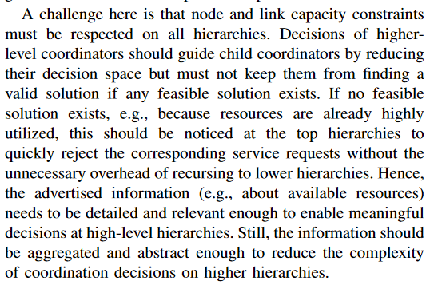

# RHODES的算法框架

​	四个层次：

​	1）network loading problem；

​        数据采集的时间间隔为周、日级。					

​		利用网络流的随机分配方法。然后将分配得到的路网OD和流量作为先验信息，根据实时数据计算后验值。

​	2）network flow control problem；

​		数据采集的时间间隔为若干分钟级。

​		包含两个方面：**状态估计**和**流控制**；

​    	其中，状态估计主要是不断更新流量估计值和预测曲线；

​				流控制用于确定大致（approximate)的相位和绿灯方案。分为两部分，一个称为节点间的通行能力分配(capacity allocation)，主要计算相位差和绿信比； 另一个称为节点的网络协调(network coordination)，主要确定相位和大致的绿灯时长；

​               

​               在流控制方面，主要采用REALBAND（基于决策树）算法，解决区域层面的车队冲突问题。

​               其中，决策树的每个节点代表车队的冲突，分支代表给某个车队的优先通行权或者某个车队被拆分；算法   更新的时间窗口的长短 或者 评价指标的上限（upper bound，如延误、停车次数），决定了决策树延伸到叶节点的终止条件。

​               另外，车队的概念，参考如下：

​               

​	3）intersection control problem；

​		 数据采集的时间间隔为1分钟级。

​		 用于确定合适(appropriate)的相序和相位方案。分为两个方面：一个称为交叉口的signal scheduling。主要确定交叉口的信号组合；另一个称为交叉口的intersection dispatching。主要微调当前信号绿灯时长，延长或缩短绿灯时长。

​	4）traffic signal actuation problem；

​         用于提供配时下发的接口（interface）

# 不同控制系统的演进过程

1）fixed-time plan;

2）on-line plan selection with off-line plan generation;

3）on-line plan selection and/or plan generation;

4）on-line timing;

# Hierarchical network

​	Decisions  of  higher-level coordinators should guide child coordinators by reducing their  decision  space  but  must  not  keep  them  from  finding  avalid  solution  if  any  feasible  solution  exists. 

​	Phase I —广播信息{节点信息，外部路径，内部路径}，maximum flow path ：use the Ford-Fulkerson algorithm with Edmon Karp path selection.

​	Phase2—节点协调，method of solution: Mixed Integer Linear Program(MILP)

​                     协调策略：the coordinator scales and places services and routes traffic on the advertised paths rather than directly on substrate nodes or links.

​	

 	延伸到交通控制领域，high_level 在考虑路段和节点通行能力限制下，保证网络或局部路径通行能力最大；lower_level优先保证延误最小。

​	

# 强化学习书籍

三种算法可以用来处理时序决策问题（MDP），P4：

​	1、基于编程（programing）的解决方案。只能够工作在完全已知的且带有固定的概率分布的静态问题；

​	2、基于搜索和规划（search and planning）。当系统的动态是已知的，学习器可以通过搜索和规划，从当前的状态转移到下一个目标状态。但是，（1）当动作的结果具有不确定性时，不适用了，探索法存在可行性，但动作的概率性影响使问题的求解变得困难；（2）该算法只关注于特定的起始状态和目标状态，但我们希望得到涵盖所有状态和奖励的策略。（决策树方法属于这种方法）

​	3、学习。可以应对设计阶段、系统的不确定性、不断变化的环境。可以解决每个状态的问题，而不仅仅是从一个状态转换到另一个状态的规划。（后续需要结合神经网络模型，进行学习）

## 基于模型的强化学习

1、 优点：

 		1）样本的利用更加高效。一旦学习到准确的模型，无需任何额外的经验（即不用与环境交互，多次跟踪目标的轨迹），就可以得到一个最优策略。

​		当然，模型可以完全从头开始学习，或者给出模型的结构以便只有参数需要学习，或者提供一个近乎完整的模型。

​       2）为学习器进行目标探索提供了机会。学习器可以通过模型来规划一个策略，以驱动学习器探索特定的状态。

2、模型的解释

​		模型是学习器所需要的信息，旨在模拟在马尔可夫决策过程（MDP）中采取一个动作的结果。

​		例如，学习器从状态s采取动作a，模型就需要预测下一个状态$s^,$和回报r。

​	   模型的学习有很多种方法，在自适应动态规划领域大都采用神经网络去学习域的模型。

3、规划的解释

​		基于模型计算策略的过程叫做规划。一旦学习器学习到域动态的近似模型，该模型可以用来学习一个改进的策略。

​       规划的方法主要有1）动态规划方法，比如值迭代或者策略迭代；2）蒙特卡罗方法，特别是蒙特卡罗搜索树（MCTS）。其中MCTS的基础或者理论基础是稀疏采样方法。

  	 其中，蒙特卡罗搜索树建立了一棵从当前状态到访问的状态-动作对的树。

4、联合模型和规划

​		 学习器（agent）可以采用这样的流程： 更新模型 -> 模型 -> 规划 -> 策略

​		 即基于模型的学习器交错顺序地学习和规划，首先完成对模型的更新，然后规划在更新的模型上计算一个策略。

​		 联合模型和规划的方法，代表性模型有DYNA-2。

​         实时联合模型和规划的架构方面，代表性的方法是todd Hester提出的线性架构，将模型学习、规划和动作分在三个并行线程中。通过四个共享的数据结构进行线程间通信：

​		1）要添加到模型的经验列表；

​		2）规划器使用的模型副本；

​		3）规划器规划的当前状态；

​		4）学习器的策略。

​		三个线程的运行过程：模型学习线程运行在一个循环中，从新经验列表中删除经验，更新其模型，然后拷贝到规划线程中。规划线程运行一个基于采样的规划算法（比如UCT），从学习器的当前状态进行规划以及更新策略。动作线程添加最近的经验到更新列表中，设置学习器的当前状态用于规划，并从其策略中返回对该状态的最佳动作。

 

